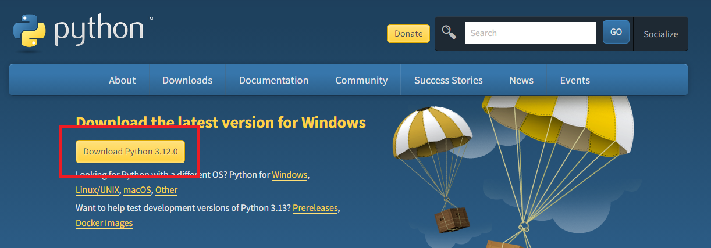
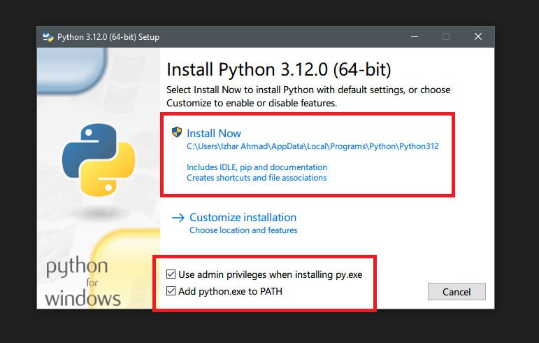

# 1.1. Installing Python
This page goes over the process of installing Python in your machine.

!!! info

    It is recommended that you install the latest marked version. This guide is for Python 3.
    Python 2 is not supported by this guide. Python 3.8 or any higher version is recommended.

## On Windows
To install Python, first download its setup from [python.org/downloads](https://www.python.org/downloads/).



This will download the setup for Python. After downloading, open the setup. Make
sure you tick both of shown checkboxes before clicking **"Install Now"**:



- **Use admin privileges when installing py.exe** ensures installation is done as
  administrator to prevent any potential permission issues while installation.

- **Add python.exe to PATH** allows you to use the `python` in command line to run
  your programs or use interpreter on command line. This would be useful throughout
  this guide.

After clicking **Install Now**, Python installation would start. Click "Yes" when prompted
with administrator popup.

## On MacOS
Setup for MacOS can be downloaded from the same page and follows a similar straight forward
installation procedure.

## On Linux
On linux based operating systems, Python may already be installed.

To see the version of Python 3 installed, run the following command:
```
$ python3 --version
```

In case Python is not installed, you can install it using:
```
$ sudo apt-get update
$ sudo apt-get install python3.12
```
To install a different version, change the suffix of second command to include that version.

---

After installation, use the `python` command in terminal (`python3` for Linux) to ensure
that installation was successful. You should get an output something like this:
```
$ python
Python 3.11.2 (tags/v3.11.2:878ead1, Feb  7 2023, 16:38:35) [MSC v.1934 64 bit (AMD64)] on win32
Type "help", "copyright", "credits" or "license" for more information.
>>> 
```

If you did everything correctly, Python should be installed. Congratulations.
