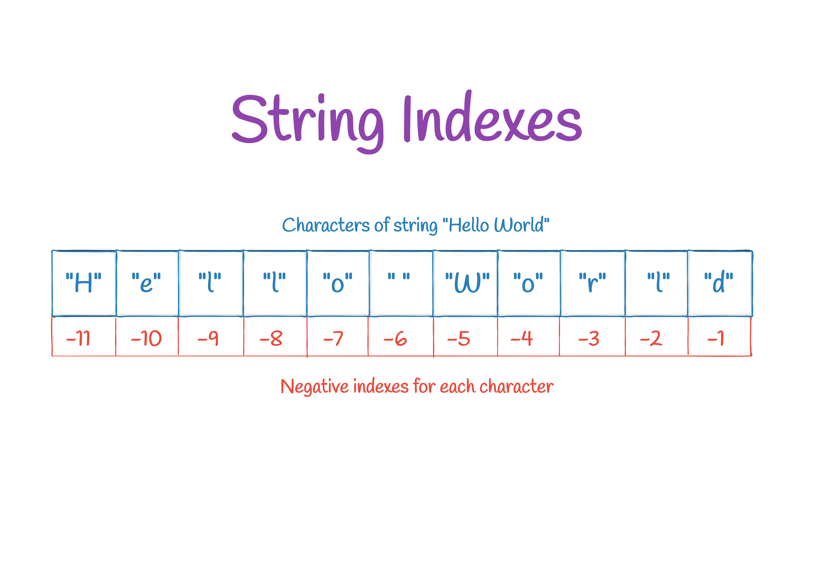

# 4.1. Indexing Strings
In this section, we'll learn about various operations that we can perform on the `str` data
type to manipulate it.

## Understanding string indexes
A string can be seen as a list of many characters. For example, `"Hello"` could be seen
as a list of characters `H`,`e`, `l`, `l`, and `o`.

Each character in a string has a specific index. Starting from 0, an index is used to
point to a specific character of a string.

Example:

=== "Code"

    ```py
    string = 'Hello World'
    print(string[0])
    print(string[1])
    print(string[2])
    ```

=== "Output"

    ```
    H
    e
    l
    ```


`string[index]` returns a separate string that has only one character that was located
at the `index` position in original `string`.

!!! note

    Note that a space `" "` is also considered a character. e.g. `"A B C"` has five characters
    including two spaces and accessing second character, `"A B C"[1]` returns `" "`.

## Negative indexes
When we have a string with arbitrary number of characters and we want to get a character
from the end of string, we can use negative indexes.

Negative indexes always start from `-1` with `-1` representing the last character
of string, `-2` for second last and so on.

=== "Code"

    ```py
    string = 'Hello World'
    print(string[-1])
    print(string[-2])
    print(string[-3])
    ```

=== "Output"

    ```
    d
    l
    r
    ```



## The `IndexError` error
`IndexError` is an error raised when we try to access an index that doesn't exist or
exceeds the maximum index.

=== "Code"

    ```py
    string = 'Hello World'
    print(string[10])  # last index
    print(string[11])  # IndexError occurs!
    ```

=== "Output"

    ```
    d
    Traceback (most recent call last):
      File "G:\thepyguide\main.py", line 3, in <module>
        print(string[11])  # IndexError occurs!
            ~~~~~~^^^^
    IndexError: string index out of range
    ```

The same goes for negative indexes too:

=== "Code"

    ```py
    string = 'Hello World'
    print(string[-11])  # last negative index (i.e first character)
    print(string[-12])
    ```

=== "Output"

    ```
    H
    Traceback (most recent call last):
      File "G:\thepyguide\main.py", line 3, in <module>
        print(string[-12])  # IndexError occurs!
            ~~~~~~^^^^
    IndexError: string index out of range
    ```

<!-- TODO: pageref -->

!!! tip

    We'll learn later in this guide on how to handle errors using the `try` and `except`
    statements.
